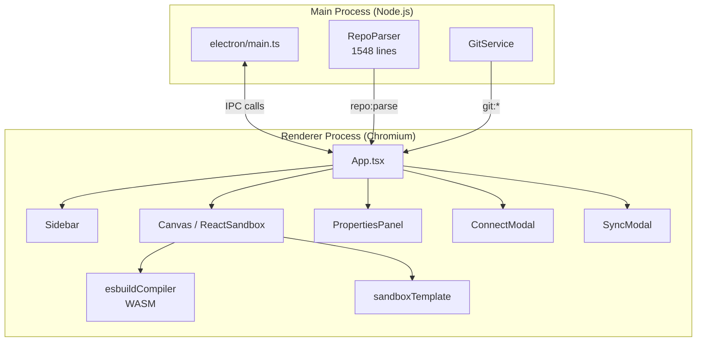
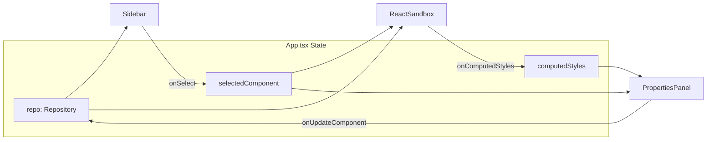

<div align="center">

# ⚒️ UI Forge

**Visual Design System Editor — Connect your component library, preview & edit components live, and sync changes back to code.**

Built with **Electron** + **React 19** + **TypeScript** + **esbuild-wasm**

</div>

---

## 📋 Table of Contents

- [What is UI Forge?](#what-is-ui-forge)
- [For Designers — How It Works](#for-designers--how-it-works)
- [Architecture Overview](#architecture-overview)
- [Project Structure](#project-structure)
- [Tech Stack](#tech-stack)
- [Getting Started](#getting-started)
- [How the Pieces Fit Together](#how-the-pieces-fit-together)
- [Key Concepts](#key-concepts)
- [IPC Communication Map](#ipc-communication-map)
- [Data Flow](#data-flow)
- [Component Reference](#component-reference)
- [Service Reference](#service-reference)
- [Type System](#type-system)
- [Configuration Files](#configuration-files)
- [Building for Production](#building-for-production)
- [Troubleshooting](#troubleshooting)

---

## What is UI Forge?

UI Forge is a **desktop application** (Electron) that lets you:

1. **Connect** a Git repository containing a React component library (e.g. a Design System).
2. **Parse** the repository to automatically extract components, variants, props, design tokens, and CSS.
3. **Preview** components in a high-fidelity, isolated sandbox with live React rendering.
4. **Edit** properties (props, styles, spacing, colors) visually through a Properties Panel.
5. **Sync** changes back to the repository via Git (commit & push).

> [!NOTE]
> UI Forge works in **two modes**: as a full **Electron desktop app** with Git integration, or as a **web preview** (via `npm run dev`) for quick UI development and testing.

---

## For Designers — How It Works

If you're a designer (not a developer), here's what you need to know:

```
┌────────────────────────────────────────────────────────────────┐
│                         UI Forge                               │
│                                                                │
│  ┌──────────┐    ┌──────────────────┐    ┌─────────────────┐  │
│  │ SIDEBAR   │    │     CANVAS       │    │ PROPERTIES      │  │
│  │           │    │                  │    │ PANEL           │  │
│  │ • Comps   │    │  Live preview    │    │                 │  │
│  │ • Tokens  │    │  of the          │    │ • Sizing        │  │
│  │ • Stories │    │  selected        │    │ • Spacing       │  │
│  │           │    │  component       │    │ • Colors        │  │
│  │ Click to  │    │                  │    │ • Typography    │  │
│  │ select    │    │  (Real React!)   │    │ • Props         │  │
│  │           │    │                  │    │ • Variants      │  │
│  └──────────┘    └──────────────────┘    └─────────────────┘  │
└────────────────────────────────────────────────────────────────┘
```

| Area | What it does |
|------|-------------|
| **Sidebar** (left) | Browse all components and design tokens from the connected repository. Click to select. |
| **Canvas** (center) | Shows a **live, interactive preview** of the selected component — rendered with actual React, not a screenshot. |
| **Properties Panel** (right) | Inspect and edit the selected component's sizing, spacing, colors, typography, props, and variants. Changes update the preview in real-time. |

### Key terms for designers

| Term | Meaning |
|------|---------|
| **Component** | A reusable UI piece (Button, Card, Input, etc.) |
| **Variant** | A visual variation (e.g. Button → Primary, Secondary, Ghost) |
| **Design Token** | A named value for colors, spacing, or typography (e.g. `--primary-color: #2563eb`) |
| **Props** | Configurable parameters of a component (e.g. `disabled`, `size`, `label`) |
| **CSS Modules** | Scoped stylesheets that prevent style conflicts between components |

---

## Architecture Overview

UI Forge uses Electron's **two-process model**:



| Process | Runs in | Responsibilities |
|---------|---------|-----------------|
| **Main** | Node.js | File system access, Git operations, repository parsing |
| **Renderer** | Chromium browser | UI, component preview, in-browser compilation via esbuild-wasm |

---

## Project Structure

```
ui-forge/
├── index.html              # Entry HTML — loads Tailwind CDN + import maps
├── index.tsx               # React entry point (createRoot)
├── App.tsx                 # Root component — orchestrates all panels & state
├── types.ts                # Shared TypeScript interfaces (ComponentNode, Repository, Token…)
├── constants.ts            # UI constants (spacing, colors, fonts, shadows)
│
├── components/
│   ├── Sidebar.tsx         # Left panel — component & token tree navigation
│   ├── Canvas.tsx          # Static canvas fallback (Babel-based rendering)
│   ├── ReactSandbox.tsx    # ⭐ Live React preview via iframe + esbuild-wasm
│   ├── ReactSandbox/
│   │   └── sandboxTemplate.ts  # HTML template for sandbox iframe
│   ├── PropertiesPanel.tsx # Right panel — style/prop editing (982 lines)
│   ├── PropertiesPanel/
│   │   └── hooks/
│   │       └── useStyleOverrides.ts  # Hook for CSS Module style overrides
│   ├── ConnectModal.tsx    # Repository connection dialog (clone / open local)
│   ├── SyncModal.tsx       # Git commit & push dialog
│   ├── StaticCanvas.tsx    # Static preview with variant matrix view
│   └── TitleBar.tsx        # Custom window title bar (Electron-only)
│
├── electron/
│   ├── main.ts             # Electron main process — window + IPC handlers
│   ├── preload.ts          # Context bridge (electronAPI) — secure IPC
│   └── services/
│       ├── repoParser.ts   # ⭐ Core extraction engine (1548 lines)
│       └── gitService.ts   # Git operations via simple-git
│
├── lib/
│   └── esbuildCompiler.ts  # ⭐ Browser-side TSX/JSX compilation via WASM
│
├── services/
│   └── geminiService.ts    # Gemini AI integration (style generation)
│
├── types/
│   ├── electron.d.ts       # TypeScript types for electronAPI bridge
│   └── css.d.ts            # CSS Module type declarations
│
├── public/
│   └── esbuild.wasm        # esbuild WebAssembly binary (13.5 MB)
│
├── dist-electron/          # Compiled Electron output (auto-generated)
│
├── package.json            # Dependencies & scripts
├── vite.config.ts          # Vite configuration (port 3000, path alias @/)
├── tsconfig.json           # TypeScript config (renderer)
├── tsconfig.electron.json  # TypeScript config (main process)
├── tsconfig.preload.json   # TypeScript config (preload script)
└── metadata.json           # App metadata
```

### Key: ⭐ = Core Engine Files

These are the most important files to understand:

| File | Lines | Purpose |
|------|-------|---------|
| `electron/services/repoParser.ts` | 1548 | Parses a Design System repo — extracts components, CSS, props, variants, tokens, and forgecore.json manifest |
| `components/ReactSandbox.tsx` | 462 | Renders live React components inside an isolated iframe using esbuild-wasm |
| `lib/esbuildCompiler.ts` | 454 | Compiles TSX/JSX → JavaScript in the browser via WebAssembly |
| `components/PropertiesPanel.tsx` | 982 | Visual property editor with color pickers, spacing controls, typography, and AI edit |

---

## Tech Stack

| Technology | Version | Purpose |
|-----------|---------|---------|
| **Electron** | 40.x | Desktop shell (Node.js + Chromium) |
| **React** | 19.x | UI framework |
| **TypeScript** | 5.8 | Type safety |
| **Vite** | 6.x | Dev server & bundler |
| **esbuild-wasm** | 0.27 | In-browser JSX/TSX compilation |
| **Tailwind CSS** | CDN | Utility-first styling |
| **simple-git** | 3.x | Git operations in Node.js |
| **Lucide React** | 0.563 | Icon library |
| **@google/genai** | 1.39 | Gemini AI for style generation |
| **@babel/standalone** | 7.x | Fallback static canvas compilation |
| **clsx + tailwind-merge** | — | Tailwind class utilities |

---

## Getting Started

### Prerequisites

- **Node.js** ≥ 18
- **npm** ≥ 9
- (Optional) **Gemini API key** for AI-powered style editing

### 1. Install dependencies

```bash
npm install
```

### 2. Set up environment variables

Create a `.env.local` file in the root:

```env
GEMINI_API_KEY=your_api_key_here
```

### 3. Run in web mode (preview only)

```bash
npm run dev
```

Opens at `http://localhost:3000`. No Git/file-system features — good for UI development.

### 4. Run as Electron app (full features)

```bash
npm run electron:dev
```

This starts Vite + Electron concurrently. Full Git operations & repository parsing available.

### Available Scripts

| Script | Description |
|--------|-------------|
| `npm run dev` | Start Vite dev server (web mode only) |
| `npm run build` | Build renderer for production |
| `npm run electron:dev` | Dev mode with full Electron + Vite |
| `npm run electron:build` | Package the desktop app (dmg/nsis/AppImage) |
| `npm run electron:preview` | Build + run Electron locally |

---

## How the Pieces Fit Together

### Step-by-step: What happens when you connect a repo

```
1. User clicks "Connect" in the Sidebar
       ↓
2. ConnectModal opens → User enters repo URL or selects local directory
       ↓
3. App.tsx calls electronAPI.git.clone() or electronAPI.repo.parse()
       ↓
4. [Main Process] GitService clones the repo (if remote)
       ↓
5. [Main Process] RepoParser scans the directory:
   • Looks for forgecore.json manifest
   • Finds component files (.tsx/.jsx)
   • Reads CSS Modules (.module.css)
   • Extracts props, variants, design tokens
   • Reads .stories.tsx files for story variants
       ↓
6. Parsed data returns to Renderer via IPC
       ↓
7. App.tsx stores it in state → Sidebar, Canvas, PropertiesPanel render
       ↓
8. User selects a component in Sidebar
       ↓
9. ReactSandbox compiles it with esbuild-wasm and renders in iframe
```

### Step-by-step: What happens when you edit a property

```
1. User changes a value in PropertiesPanel (e.g. padding)
       ↓
2. PropertiesPanel calls onUpdateComponent(updatedComponent)
       ↓
3. App.tsx updates the component in its state
       ↓
4. ReactSandbox re-compiles & re-renders the preview
       ↓
5. (Optional) User clicks "Sync" → SyncModal commits & pushes via Git
```

---

## Key Concepts

### Forgecore Manifest (`forgecore.json`)

This is the **configuration file** that UI Forge looks for in the root of a connected repository. It describes:

- **Components**: Entry files, styles, props, dependencies, preview configuration
- **Utilities**: Custom module stubs for browser rendering
- **Design tokens**: Token source paths and theming configuration
- **Runtime**: React version, bundler preferences, CSS strategy

> [!TIP]
> Without a `forgecore.json`, UI Forge falls back to auto-discovery — scanning for `.tsx` files and `.module.css` files — but the manifest gives much better results.

### Style Overrides

For CSS Module-based components, UI Forge uses a **non-destructive** editing approach:

- The original CSS is never modified in-memory.
- Visual changes are stored as `styleOverrides` on the ComponentNode.
- These are injected as inline styles or CSS variables at render time.
- Overrides can be scoped per variant/size combination (`styleOverridesPerVariant`).

### Sandbox Isolation

Components are rendered inside an `<iframe>` with:
- Its own React 19 runtime (loaded from CDN)
- Theme CSS injected as `<style>` tags
- Props communicated via `postMessage`
- Import stubs for unavailable modules (e.g. `next/link`, `next/image`)

---

## IPC Communication Map

Communication between Renderer ↔ Main Process uses Electron's `ipcMain.handle` / `ipcRenderer.invoke` pattern:

| Channel | Direction | Purpose |
|---------|-----------|---------|
| `git:clone` | Renderer → Main | Clone a remote repository |
| `git:status` | Renderer → Main | Get repo status (files, branch, ahead/behind) |
| `git:commit-push` | Renderer → Main | Stage all, commit, and push |
| `git:create-branch` | Renderer → Main | Create and checkout a new branch |
| `git:list-repos` | Renderer → Main | List all locally cloned repos |
| `dialog:select-directory` | Renderer → Main | Open native folder picker |
| `repo:parse` | Renderer → Main | Parse a repository with RepoParser |
| `window:minimize` | Renderer → Main | Minimize the app window |
| `window:maximize` | Renderer → Main | Toggle maximize/restore |
| `window:close` | Renderer → Main | Close the app window |

> All IPC calls are typed via `types/electron.d.ts` and exposed through `electron/preload.ts`.

---

## Data Flow



### State management

UI Forge uses **React's built-in useState** — no external state library. All state lives in `App.tsx`:

| State | Type | Description |
|-------|------|-------------|
| `repo` | `Repository` | Full repository data (components, tokens, theme) |
| `selectedId` | `string \| null` | ID of the selected component or token |
| `zoom` | `number` | Canvas zoom level |
| `computedStyles` | `ComputedStylesData` | Computed CSS values from the live preview |
| `connectModalOpen` | `boolean` | ConnectModal visibility |
| `syncModalOpen` | `boolean` | SyncModal visibility |
| `toast` | `object` | Toast notification state |

---

## Component Reference

### UI Components

| Component | File | Description |
|-----------|------|-------------|
| `App` | `App.tsx` | Root orchestrator. Manages state, modals, and the 3-column layout. |
| `Sidebar` | `components/Sidebar.tsx` | Tree view of components (grouped by category), tokens, and story variants. |
| `ReactSandbox` | `components/ReactSandbox.tsx` | Iframe-based live preview. Handles esbuild compilation, HTML generation, message passing. |
| `Canvas` | `components/Canvas.tsx` | Legacy static canvas using Babel. Fallback when esbuild isn't available. |
| `StaticCanvas` | `components/StaticCanvas.tsx` | Static preview with variant matrix and state views. |
| `PropertiesPanel` | `components/PropertiesPanel.tsx` | Right panel: sizing, spacing, colors, typography, props, AI edit, and variant management. |
| `ConnectModal` | `components/ConnectModal.tsx` | Modal for cloning a repo (HTTPS/SSH) or selecting a local directory. |
| `SyncModal` | `components/SyncModal.tsx` | Modal for committing and pushing changes. |
| `TitleBar` | `components/TitleBar.tsx` | Custom macOS/Windows title bar (hidden when running in web mode). |

### Internal Modules

| Module | File | Description |
|--------|------|-------------|
| `sandboxTemplate` | `components/ReactSandbox/sandboxTemplate.ts` | Generates the full HTML document injected into the preview iframe. |
| `useStyleOverrides` | `components/PropertiesPanel/hooks/useStyleOverrides.ts` | Hook managing non-destructive CSS overrides per variant. |

---

## Service Reference

### Main Process Services

| Service | File | Description |
|---------|------|-------------|
| `RepoParser` | `electron/services/repoParser.ts` | The core engine. Parses repository directories, reads `forgecore.json`, extracts component metadata, CSS, tokens, props, and story variants. |
| `GitService` | `electron/services/gitService.ts` | Git operations: clone, status, commit, push, branch creation, repo listing. Uses `simple-git`. |

### Renderer Services

| Service | File | Description |
|---------|------|-------------|
| `esbuildCompiler` | `lib/esbuildCompiler.ts` | Browser-side JSX/TSX compilation via esbuild-wasm. Creates preview bundles with import stubs and CSS Module transforms. |
| `geminiService` | `services/geminiService.ts` | Gemini AI integration for generating/modifying Tailwind classes and suggesting component variants. |

---

## Type System

All types are defined in two files:

### `types.ts` — Renderer-side types

```typescript
// Core data model
ComponentNode          // A parsed component with props, variants, styles
Repository             // Full repo: components[], tokens[], themeCSS, utilities
Token                  // Design token (color, spacing, typography, radius)
ComponentVariant       // Variant definition (name, type, cssClass)
StoryVariant           // Story from .stories.tsx
ComponentPropDef       // Prop definition for editor controls
GenerationConfig       // AI generation input
SyncPayload            // Git sync parameters
```

### `types/electron.d.ts` — IPC bridge types

```typescript
ElectronAPI            // Shape of window.electronAPI
GitResult<T>           // Standard IPC response wrapper
ParsedComponent        // Component as returned by RepoParser
ParsedRepoContents     // Full parse result
```

---

## Configuration Files

| File | Purpose |
|------|---------|
| `vite.config.ts` | Dev server (port 3000), React plugin, path alias `@/`, Gemini API key injection |
| `tsconfig.json` | Renderer TypeScript config |
| `tsconfig.electron.json` | Main process TypeScript config (ES2022, NodeNext) |
| `tsconfig.preload.json` | Preload script TypeScript config |
| `package.json` → `build` | Electron Builder config (macOS dmg, Windows nsis, Linux AppImage) |
| `.env.local` | Environment variables (`GEMINI_API_KEY`) |
| `.gitignore` | Ignores node_modules, dist, dist-ssr, .DS_Store, editor configs |

---

## Building for Production

### Package the desktop app

```bash
npm run electron:build
```

This will:
1. Build the Vite renderer → `dist/`
2. Compile Electron TypeScript → `dist-electron/`
3. Package with electron-builder → `release/`

Output formats:
- **macOS**: `.dmg`, `.zip`
- **Windows**: `.exe` (NSIS installer), portable `.exe`
- **Linux**: `.AppImage`, `.deb`

---

## Troubleshooting

| Issue | Solution |
|-------|----------|
| **esbuild WASM fails to load** | Ensure `public/esbuild.wasm` exists (13.5 MB). It's loaded at runtime. |
| **"electronAPI is not defined"** | You're running in web mode (`npm run dev`). Use `npm run electron:dev` for full features. |
| **Components don't render in preview** | Check the browser console for esbuild compilation errors. Ensure the component has valid `sourceCode`. |
| **Git operations fail** | Verify SSH keys or HTTPS credentials are configured on your system. |
| **Styles look wrong in preview** | The theme CSS (`themeCSS`) might not be injecting. Check that the repo has a globals.css or tokens file. |
| **EPIPE errors in console** | These are Electron IPC buffer overflows — usually from excessive logging. They're handled gracefully. |

---

<div align="center">

**UI Forge** — *Bridge the gap between code and design.*

</div>
